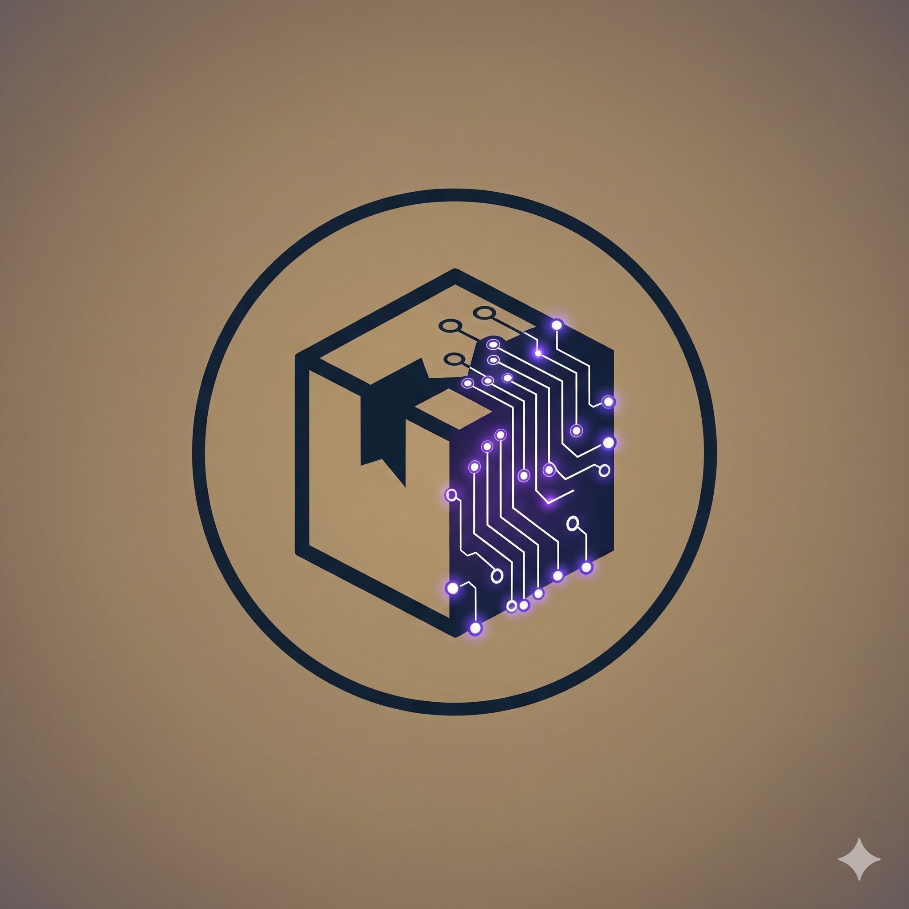

<div align="center">



# 📦 Nukecraft5419 Maven Repository


This is the official public Maven repository for **Nukecraft5419**.
It hosts various APIs, libraries, and frameworks for Java and Minecraft development.

🌐 **Web Interface:** [repo.nukecraft5419.com](https://repo.nukecraft5419.com/)

</div>

---

## 🚀 How to use

To use artifacts from this repository, add the following to your build configuration:

### 🐘 Gradle (Kotlin DSL)

```kotlin
repositories {
    mavenCentral()
    maven("[https://repo.nukecraft5419.com/](https://repo.nukecraft5419.com/)")
}
```

### 🐘 Gradle (Groovy)

```gradle
repositories {
    mavenCentral()
    maven { url '[https://repo.nukecraft5419.com/](https://repo.nukecraft5419.com/)' }
}
```

### 📦 Maven

```maven
<repository>
    <id>nukecraft5419-repo</id>
    <url>[https://repo.nukecraft5419.com/](https://repo.nukecraft5419.com/)</url>
</repository>
```

### 📂 Repository Content

This repository follows the standard Maven structure. You can browse the available artifacts directly via the web interface or by navigating the directory tree on GitHub.

**Group ID:** dev.nukecraft5419

**Projects:** NukeLexicon, and more coming soon.

### 🤝 Contributing

If you find any issues with the repository infrastructure or the web landing page, feel free to open an issue or a pull request.

### 📄 License

This project is licensed under the MIT License.

<div align="center">
  <sub>Built with ❤️ by Nukecraft5419</sub>
</div>
